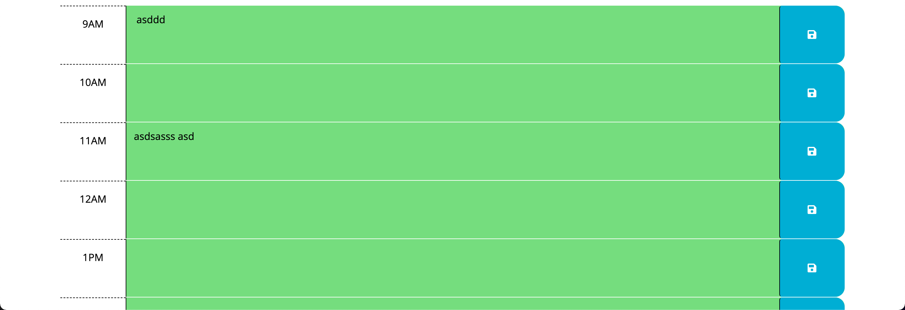

# work-day-scheduler

# description

The Scheduling Site is a web application designed to help users manage their daily schedules effectively. It provides a user-friendly interface where users can input tasks for each hour of the day and track their progress throughout the day.

# Motivation

The motivation behind developing this application was to provide users with a convenient tool to organize and prioritise their tasks, leading to improved productivity and time management skills.

# Features

- Display of the current date and time.

- Styling of time blocks based on the current hour.

- Disable input for past time blocks to prevent editing.

- Save user input for each time block in local storage for persistent storage.

- Interactive interface with easy task entry and management.

# created using

- HTML
- CSS
- JavaScript
- jQuery
- Day.js

# how to use  

- Clone the repository.

- Open the index.html file in a web browser.

- Enter your tasks for each hour of the day in the corresponding time blocks.

- Save your input using the provided save buttons.

- View and edit your saved tasks as needed.

# Screenshots  

# Future Development

- Implement user authentication for personalised schedules.

- Add reminders and notifications for upcoming tasks.

- Integrate with a calendar system for better organisation.

- Enable sharing and collaboration features for group scheduling.